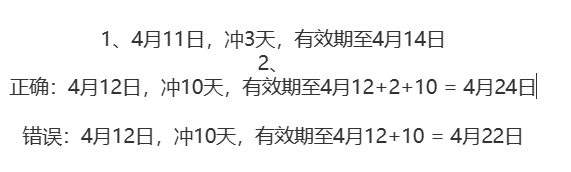

# ---Vue-Springboot-MySQL-

# 问题：
1.需要把用户密码登录改为手机号登录（先改前台用户）

2.续费逻辑

剩余的时间 + now() + 充值天数 = 到期日期

需要软件清单：

- redis
- redis图形工具
- 内网穿透工具（本人用的贝瑞花生壳）
- 支付宝沙箱账号以及环境
- jdk8以上
- node.js 14以上
- apifox(可用可不用)
- mysql8及以上